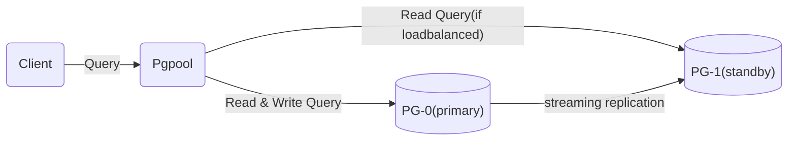

## postgres 이중화는 뭘로 할까?

일반적으로 IT 분야에서 제일 많이 사용하는 DB 중 하나는 PostgreSQL일 것이다.  
안정적인 성능과 다양한 타입의 컬럼 등, DB 랭킹을 매기는 DB 엔진에서 4위에 자리매김할 정도로(2024년 현재 기준) 인기 있는 DB인 postgres는 지금도 여러 곳에서 쓰이며 활약하고 있다.  
postgres의 장점이라면 역시나 오픈 소스이기에 내부 동작이 투명하고(물론 직접 소스를 까보는 경우는 그리 많지 않겠지만) 라이센스가 BSD이기에 돈이 들지 않는다는(회사 등 사용자의 입장에서) 점일 것이다.  
하지만 이렇듯 오픈 소스라서 안 좋은 점도 있는데, 그것은 딱히 돈을 받고 운영하는 것이 아니기 때문에 사용자 입장에서 책임을 묻기가 쉽지 않다는 점일 것이다.  
가령 DB가 Oracle이라면 운영 주체인 Oracle에 가서 "이건 왜 안 됩니까?"하고 따지면 되는데 postgres의 경우에는 그게 통하지가 않는다는 것이다.  
이중화 역시도 그런 부분이라고 할 수 있다.  
Oracle이 RAC를 통해 비싸기는 해도 공식적으로 이중화를 지원하는 반면, postgres는 공식적으로 이중화를 지원하기는 하나 failover나 failback 등의 부분에서 불편한 부분이 있는 것이 사실이다(일일이 명령어를 쳐줘야 하기 때문).  
때문에 서드 파티 솔루션을 사용해서 데이터 복제와 자동 failover, 로드밸런싱 등을 처리해주는 것이 보통이다.  
구체적으로 어떤 상황에 어떤 방법을 사용해야 하는지에 대해서는 [공식 홈페이지](https://www.postgresql.org/docs/current/different-replication-solutions.html)와 [위키 페이지](https://wiki.postgresql.org/wiki/Replication,_Clustering,_and_Connection_Pooling)를 통해 확인하면 되는데, 솔직히 쓱 보기만 해도 머리가 아프다.  
여기에서는 많이들 사용하는 조합인 Pgpool-II와 repmgr을 이용하여 bitnami에서 제공하는 도커 컨테이너를 통한 이중화를 구현해보고자 한다.  

## pgpool과 repmgr을 조합하는 이유

pgpool이면 pgpool이고 repmgr이면 repmgr이지 왜 두 솔루션을 조합해서 이중화를 구성해야 하는지 의문이 들 것이다.  
pgpool은 로드밸런서로서 커넥션 풀을 관리하는 것이 주 기능이다.  
postgres의 앞단에 위치하여 부하를 분산하고 과도한 커넥션이 늘어나는 것을 방지한다.  
반면 repmgr는 데이터 복제의 역할을 맡는다.  
postgres의 streaming replication 기능을 이용하여 primary의 데이터를 standby 서버에 복제하여 핫 스탠바이 기능을 유지하고 primary가 죽을 경우 failover의 책임을 맡는다.  

복제 기능의 경우 pgpool 역시 가능하지만 어째서 repmgr를 이용하느냐고 하면, pgpool의 경우 복제 방식이 SQL 기반이기 때문이다.  
pgpool은 복제를 할 때 로드밸런서로서 받은 SQL 쿼리를 각 DB에 때려박는다.  
이러한 방식은 커다란 문제점이 있는데, 그중의 하나는 모종의 이유로 postgres 중 한쪽이 쿼리 실행을 실패할 경우 해당 내용은 복구가 쉽지 않다는 점이다.  
따라서 pgpool의 복제 기능은 사용하지 않고 streaming replication을 이용하는 repmgr에 그 역할을 맡기는 것이다.  

## bitnami? 처음 들어보는데 써도 되는 건지

pgpool과 repmgr를 도커에 올려 사용하기 위해서는 도커 이미지가 있어야 한다.  
그러나 도커 허브에 pgpool을 검색해보면 공식 이미지는 다운로드 수가 500K이고 repmgr은 심지어 공식 이미지가 존재하지 않는다는 것을 알 수 있다.  
그에 반해 bitnami/pgpool의 다운로드 수는 10M이나 되는 것을 알 수 있는데, 사실 이 정도만 해도 우리가 bitnami를 쓸 이유로는 충분할 것이다.  
bitnami는 참고로 우리가 잘 아는 VMware라는 회사에서 제공하는, 일종의 오픈 소스를 엔터프라이즈 급으로 사용하기 쉽게 래핑한 라이브러리라고 해야 할 것이다.  
VMware 회사의 일부 파트라고 보면 좋을지도 모르겠다.  
bitnami의 [github](https://github.com/bitnami/containers/tree/main/bitnami)에 들어가 프로젝트를 보면 pgpool이나 repmgr 이외에도 tensorflow, logstash, grafana 등 여러 오픈 소스 프로젝트의 컨테이너를 확인할 수 있는데, 라이센스를 확인해보면 아파치 라이센스 2.0으로서 무료 이용에도 문제가 없음을 알 수가 있다.  
불안하다면 소스를 까보면 될 것이다.  

거기에 덧붙여 이미지의 구성을 보면 pgpool 이미지가 있고 postgresql-repmgr 이미지가 있음을 알 수가 있다.  
repmgr의 경우 postgres의 저장소에 붙어 작업을 해야 하므로 따로 떼어놓을 수가 없는 구조이다.  
참고로 bitnami의 chart 중에 postgresql-ha가 있는데 이는 같은 구조이지만 쿠버네티스 용이므로 쿠버네티스 이용자의 경우는 이를 참고하면 될 것이다.  
여기서는 도커에 설치를 할 것이므로 pgpool과 postgresql-repmgr 이미지를 이용한다.  

## 아키텍쳐

위와 같은 구조에서 데이터의 흐름은 다음과 같다.  
우선 pgpool과 postgresql-repmgr가 올라간 상태에서 각 컨테이너 사이에 커넥션이 맺어진다(커넥션 풀링).  
이후, 클라이언트의 요청에 따라 클라이언트가 pgpool과 커넥션을 맺는다.  
그리고 pgpool은 어떤 쿼리 요청이 들어오면 write 쿼리(CUD)의 경우 primary 노드로, read 쿼리(R)의 경우 로드밸런싱이 true라면 primary 노드와 standby 노드에 분산해서, false라면 primary 노드로 쿼리를 보내준다.  
primary 노드에서 데이터의 변경이 일어나면 해당 내용은 repmgr을 통해 streaming replication으로 standby 노드로 전파된다.  
만약 primary 노드가 떨어지게 되면, pgpool과 repmgr은 자동으로 이를 감지하여 다른 노드를 primary로 변경한다.  
잠깐 동안의 서비스 장애 후 서비스는 정상작동하게 될 것이다.  
이를 토대로 아래의 예제에서 사용하게 될 아키텍쳐는 다음과 같다.  



## 설치 방법

설치 방법은 간단하다.  
bitnami의 [pgpool 공식 문서](https://github.com/bitnami/containers/tree/main/bitnami/pgpool)에 나온 것을 그대로 따라하면 된다.  
docker compose 기준으로 docker-compose.yml의 내용은 다음과 같다.  


```
version: '2'

networks:
  my-network:
    driver: bridge
services:
  pg-0:
    image: bitnami/postgresql-repmgr:14
    ports:
      - 5432
    volumes:
      - pg_0_data:/bitnami/postgresql
    environment:
      - POSTGRESQL_POSTGRES_PASSWORD=adminpassword
      - POSTGRESQL_USERNAME=customuser
      - POSTGRESQL_PASSWORD=custompassword
      - POSTGRESQL_DATABASE=customdatabase
      - REPMGR_PASSWORD=repmgrpassword
      - REPMGR_PRIMARY_HOST=pg-0
      - REPMGR_PARTNER_NODES=pg-0,pg-1
      - REPMGR_NODE_NAME=pg-0
      - REPMGR_NODE_NETWORK_NAME=pg-0
  pg-1:
    image: bitnami/postgresql-repmgr:14
    ports:
      - 5432
    volumes:
      - pg_1_data:/bitnami/postgresql
    environment:
      - POSTGRESQL_POSTGRES_PASSWORD=adminpassword
      - POSTGRESQL_USERNAME=customuser
      - POSTGRESQL_PASSWORD=custompassword
      - POSTGRESQL_DATABASE=customdatabase
      - REPMGR_PASSWORD=repmgrpassword
      - REPMGR_PRIMARY_HOST=pg-0
      - REPMGR_PARTNER_NODES=pg-0,pg-1
      - REPMGR_NODE_NAME=pg-1
      - REPMGR_NODE_NETWORK_NAME=pg-1
  pgpool:
    image: bitnami/pgpool:4
    ports:
      - 5432:5432
    environment:
      - PGPOOL_BACKEND_NODES=0:pg-0:5432,1:pg-1:5432
      - PGPOOL_SR_CHECK_USER=customuser
      - PGPOOL_SR_CHECK_PASSWORD=custompassword
      - PGPOOL_ENABLE_LDAP=no
      - PGPOOL_POSTGRES_USERNAME=postgres
      - PGPOOL_POSTGRES_PASSWORD=adminpassword
      - PGPOOL_ADMIN_USERNAME=admin
      - PGPOOL_ADMIN_PASSWORD=adminpassword
    healthcheck:
      test: ["CMD", "/opt/bitnami/scripts/pgpool/healthcheck.sh"]
      interval: 10s
      timeout: 5s
      retries: 5
volumes:
  pg_0_data:
    driver: local
  pg_1_data:
    driver: local
```

해당 내용으로 DB를 올린 뒤 5432 포트(pgpool 포트)로 pgAdmin 등의 툴을 통해 접속해보면 실행이 잘 되는 것을 알 수 있다.  
따로 포트를 뚫는다면 pg-0 및 pg-1 노드에 직접 접속할 수는 있지만, 로드밸런싱은 이뤄지지 않음에 주의하자.  
정말로 데이터 복제가 잘 이뤄지고 있는지를 확인하려면 pg-0, pg-1 서비스에 포트를 뚫어서 pgAdmin 등으로(혹은 각 컨테이너에 접속해서 psql을 이용해서) primary 노드에 데이터를 수정한 뒤 다른 쪽에서 확인해보면 된다.  
primary 노드가 아니라면 데이터를 수정할 수 없으므로 주의하자.  
failover가 잘 이루어지고 있는지를 확인하려면 pg-0과 pg-1 컨테이너를 번갈아가며 꺼보면서 작동이 잘 되는지를 확인하면 된다.  
아마 제대로 잘 작동할 것이다.  

## 커스터마이징

위와 같은 설정으로 해당 기능에 대해 로컬에서 테스트하는 것은 간단하지만, 실제 운영 환경에 이를 가져가기 위해서는 각 옵션에 대해 하나하나 알아야 할 필요성이 있다.  
해당 설정은 물론 공식 홈페이지 및 소스 파일을 통해 확인할 수 있지만, 일단 중요한 설정들은 다음과 같다.  

* postgresql-repmgr의 주요 설정
  * POSTGRESQL_POSTGRES_PASSWORD - PostgreSQL의 postgres 슈퍼 계정에 대한 비밀번호
  * POSTGRESQL_USERNAME - PostgreSQL에서 생성할 계정 ID
  * POSTGRESQL_PASSWORD - PostgreSQL에서 생성할 계정 비밀번호
  * POSTGRESQL_DATABASE - PostgreSQL에서 생성할 데이터베이스명
  * POSTGRESQL_MAX_CONNECTIONS - PostgreSQL 최대 접속 커넥션 수
  * REPMGR_PASSWORD - PostgreSQL에서 사용할 repmgr 계정의 비밀번호
  * REPMGR_PRIMARY_HOST - Primary 노드로 사용될 PostgreSQL 서버의 호스트
  * REPMGR_PRIMARY_PORT - Primary 노드로 사용될 PostgreSQL 서버의 포트
  * REPMGR_PARTNER_NODES - Partner 노드로 사용될 모든 PostgreSQL 서버의 호스트
  * REPMGR_NODE_NAME - 해당 노드의 이름. 임의의 이름이지만 다른 노드와는 구분되어야만 한다. XXX-1 등 -n으로 끝나게 지어주는 것이 좋다. [참고](https://www.repmgr.org/docs/5.3/configuration-file-settings.html)
  * REPMGR_NODE_NETWORK_NAME - 해당 노드의 네트워크상의 호스트명. 밑의 포트와 조합하여 PRIMARY가 아닐 경우 STANBY 노드가 된다.  
  * REPMGR_NODE_PORT - 해당 노드의 포트
  * REPMGR_NODE_PRIORITY - PRIMARY에 대한 우선순위. 숫자가 높을수록 failover시 PRIMARY가 되는 우선순위를 가진다.  

* pgpool의 주요 설정
  * PGPOOL_BACKEND_NODES - pgpool에서 관리할 모든 PostgreSQL 접속정보 목록
  * PGPOOL_SR_CHECK_USER - streaming replication을 확인할 유저. [공식 문서](https://www.pgpool.net/docs/latest/en/html/runtime-streaming-replication-check.html)에 따르면 로그인 권한이 있어야만 하며, 모든 DB 노드에 존재해야 한다.  
  * PGPOOL_SR_CHECK_PASSWORD - SR 유저의 비밀번호
  * PGPOOL_POSTGRES_USERNAME - PostgreSQL의 관리자 ID
  * PGPOOL_POSTGRES_PASSWORD - PostgreSQL의 관리자 비밀번호
  * PGPOOL_ADMIN_USERNAME - Pgpool의 관리자 ID. pcp 파일에 추가되어 pcp_ 관련 명령어를 사용할 수 있다. [공식 문서](https://www.pgpool.net/docs/latest/en/html/configuring-pcp-conf.html) 참조.  
  * PGPOOL_ADMIN_PASSWORD - Pgpool의 관리자 비밀번호
  * PGPOOL_POSTGRES_CUSTOM_USERS - pool_passwd 파일에 추가할 유저 목록. DB에 유저가 존재해도 이 목록에 있어야만 pgpool을 통해 접속할 수 있다. 콤마(,) 혹은 세미콜론(;)으로 구분.  
  * PGPOOL_POSTGRES_CUSTOM_PASSWORDS - pool_passwd 파일에 추가할 유저의 비밀번호. 콤마(,) 혹은 세미콜론(;)으로 구분.  
  * PGPOOL_ENABLE_LOAD_BALANCING - 로드밸런싱 적용 여부
  * PGPOOL_NUM_INIT_CHILDREN - pgpool child 프로세스 수. 클라이언트와의 커넥션 수라고 보면 된다. SHOW pool_processes로 확인 가능.  
  * PGPOOL_MAX_POOL - pgpool child 프로세스마다 db에 붙는 pool 수. 즉, pool의 총 수는 PGPOOL_NUM_INIT_CHILDREN * PGPOOL_MAX_POOL * (postgres backend 수)이다. SHOW pool_pools로 확인 가능.  
  * PGPOOL_CHILD_MAX_CONNECTIONS - child 프로세스의 lifetime을 connection 수로 지정한 것. 이 이상 클라이언트와 연결이 맺어질 경우 기존의 연결을 끊고 새로운 연결을 맺는다.  
  * PGPOOL_RESERVED_CONNECTIONS - 해당 커넥션 수만큼의 여유 connection을 남기고서 커넥션이 포화될 경우 "Sorry, too many clients already" 메시지를 남긴다.  

## 모니터링

위와 같이 설치를 완료했다고는 하나, 그것만으로는 실제로 트러블이 일어났을 때 정확한 대응을 하는 것이 힘들 것이다.  
각 노드의 상태가 어떠한지, 현재 설정이 어떻게 적용되어 있는지 등을 확인하고 싶을 수 있다.  

* pgpool의 경우

pgpool의 경우 pgpool에 pgAdmin 혹은 psql 등으로 접속한 상태에서 다음과 같은 명령어를 치면 된다.  

``` sql
SHOW pool_nodes;
```

그러면 다음과 같은 결과가 나오게 된다.  

``` sql
test=# show pool_nodes;
 node_id | hostname | port  | status | pg_status | lb_weight |  role   | pg_role | select_cnt | load_balance_node | replication_delay | replication_state | replication_sync_state | last_status_change  
---------+----------+-------+--------+-----------+-----------+---------+---------+------------+-------------------+-------------------+-------------------+------------------------+---------------------
 0       | /tmp     | 11002 | up     | up        | 0.500000  | primary | primary | 0          | false             | 0                 |                   |                        | 2021-02-27 15:10:19
 1       | /tmp     | 11003 | up     | up        | 0.500000  | standby | standby | 0          | true              | 0                 | streaming         | async                  | 2021-02-27 15:10:19
(2 rows)
```

중요한 건 status와 pg_status 컬럼인데, 각각 pgpool 상의 상태와 PostgreSQL 서버의 상태를 나타낸다.  
가끔씩 서버가 꺼지고 켜지는 과정에서 pg_status는 up이지만 status는 down인 경우가 있다.  
이럴 때는 pgpool 혹은 postgres를 완전히 내리고 재시작하거나(단순 restart 말고 docker compose down 후 다시 up을 했더니 해결이 됐었다.) 직접 pgpool 컨테이너에 접속해서 pcp_attach_node 명령어를 통해 해당 노드를 수동으로 붙여줘야만 한다.  
만약 저 상태에서 다른 서버가 down될 경우 기존 노드가 붙지 않은 상태이기 때문에 failover가 제대로 일어나지 않기 때문이다.  

* repmgr의 경우

repmgr의 경우는 DB상에서 간편하게 볼 수 있다.  
repmgr database에 접속하여 nodes 테이블을 확인하면 된다.  

``` sql
SELECT * FROM repmgr.nodes;
```

다만 설정이 잘못되지 않는 한, repmgr 상에서 이슈가 나는 일은 거의 없었던 것 같다.  
물론, repmgr 명령어도 존재한다.  
당연히 postgres-repmgr 컨테이너에 접속해서 확인해야만 하는 명령어다.  

``` sql
repmgr node status
```

## 보안 및 계정 설정

이와 같은 구조에서는 client와 pgpool간에, 그리고 pgpool와 postgres간에 연결이 맺어지게 되며 따라서 두 가지의 보안이 필요하다.  
다들 알듯이 postgres에서는 pg_hba.conf 파일을 통해 보안을 설정할 수 있다.  
pgpool에서는 이와 비슷하게 pool_hba.conf 파일을 통해 PostgreSQL 유저의 보안을 설정할 수 있고, pcp.conf 파일을 통해 pcp_ 관련 명령어를 실행할 pgpool 관리자 유저의 보안을 설정할 수 있다.  
덧붙여 pool_passwd 파일에는 pgpool이 관리하는 PostgreSQL 유저의 목록이 적혀 있어서, 만약 이 리스트에 없는 경우나 비밀번호가 PostgreSQL과 다르다면 접속 자체가 불가능하다.  

위의 예시에서는 PGPOOL_POSTGRES_USERNAME에 적힌 사용자(postgres)만이 pool_passwd 파일에 입력되어 있고, 따라서 해당 사용자로밖에는 postgres에 접속할 수 없다.  
PGPOOL_SR_CHECK_USER인 customuser는 PostgreSQL 서버에 계정이 만들어져 있지만, PGPOOL_SR_CHECK_USER는 말 그대로 pgpool에서 확인하기 위한 사용자로서 일반 DB 사용자가 사용하라고 만들어진 계정이 아니기 때문에 해당 계정으로는 pgpool로 접속이 불가능하다.  
다만, PostgreSQL 서버에 직접 customuser로 접속한다면 접속이 되는 것을 확인할 수 있을 것이다.  
PGPOOL_ADMIN_USERNAME로 나와 있는 admin 계정은 PostgreSQL에는 존재하지 않는 계정이다.  
하지만 pcp.conf 파일에 등록되어 pcp_ 관련 명령어를 사용할 수 있다.  
해당 계정은 다음과 같은 명령어를 사용할 때 사용된다.  

``` sh
(pgpool 컨테이너 내부에서)
(패스워드 입력 필요)
pcp_node_info -h /opt/bitnami/pgpool/tmp -U admin -W
```

만약 PGPOOL_POSTGRES_USERNAME 외에 PostgreSQL 계정을 이용하고 싶다면 PGPOOL_POSTGRES_CUSTOM_USERS와 PGPOOL_POSTGRES_CUSTOM_PASSWORDS 옵션을 통해 추가해야만 한다.  
해당 옵션을 통해 추가된 사용자는 물론 PostgreSQL에 존재해야 하며, pool_passwd 파일에 추가되어 pgpool을 통해 접속 가능하게 된다.  

덧붙이자면 설정 파일을 비롯한 pool_hba.conf, pool_passwd, pcp.conf 파일은 pgpool 컨테이너 내부의 /opt/bitnami/pgpool/conf 디렉토리에서 확인할 수 있다.  

### 주의할 점

주의할 점은 PGPOOL_SR_CHECK_USER의 경우 pool_hba.conf에 trust로 등록되기 때문에 PGPOOL_POSTGRES_USERNAME이나 PGPOOL_POSTGRES_CUSTOM_USERS와는 다르게 설정해야 한다는 점이다.  
만약 PGPOOL_SR_CHECK_USER와 같은 계정을 후자에 속한 계정으로 추가시킨다면 해당 계정은 비밀번호를 체크하지 않고 접속할 수 있게 된다.  
확실하게 체크해야 할 것이다.  

## 트러블 슈팅

### 로드밸런싱 관련

해당 구조로 테스트를 하던 도중이었다.  
당시 스프링 배치를 이용한 배치 프로그램을 개발중에 있었는데, 이전까지는 별 문제 없던 프로그램이 배치 ID를 찾지 못하는 오류를 내뱉었다.  
심지어는 항상 오류가 나는 것도 아니고 가끔씩!  
하지만 로직 상으로는 딱히 문제될 것이 없는 부분이라 의아하던 참이었다.  
애초에 만약 그 부분이 정말로 코드 상으로 문제가 존재한다고 하면, 해당 라이브러리를 사용하는 수많은 개발자로부터 문의가 올라왔을 텐데, 인터넷을 뒤져본 결과 그런 문의조차 없었던 것이다.  
때마침 pgpool을 적용한지 얼마 되지 않은 시점이었고, 곰곰히 생각해본 결과 로드밸런싱에 문제가 있다는 생각에 도달했다.  

위의 아키텍쳐에서 나온 바와 같이 pgpool은 기본적으로 write 쿼리는 primary 노드에 전달하지만, read 쿼리는 로드밸런싱이 설정된 경우(기본 설정이다.) standby 노드에 해당 쿼리를 적절히 분배한다.  
평소에는 이와 같은 부하 분산은 문제가 없겠지만, 실제로는 write 쿼리가 실행되고 변경 사항이 다른 DB에 repmgr을 통해 전파되기까지 약간의 지연이 존재한다.  
그리고 다음과 같은 시나리오를 생각해볼 수 있었다.  

1. 프로그램이 배치 생성(ID도 생성)
2. 해당 내용은 pgpool을 통해 primary 노드에 write 쿼리로 입력됨.  
3. 프로그램은 그 즉시 해당 ID를 이용하여 배치를 조회함.  
4. 해당 내용은 pgpool을 통해 로드밸런싱되어 primary 혹은 standby 노드 중 하나로 read 쿼리가 날아감.  
5. read 쿼리가 primary로 날아간다면 모르겠지만(이때는 성공) standby 노드로 날아갈 경우 드물게 repmgr의 지연으로 인해 해당 데이터가 없는 상태로 쿼리가 실행됨(조회 실패)
6. 프로그램은 배치 ID로 배치 조회를 실패함.  

그리고 pgpool의 로드밸런싱 기능을 끄자, 역시나 더 이상 오류가 발생하지 않는 것을 확인할 수 있었다.  
물론 이와 같이 repmgr를 통한 streaming replication이 지연되는 것은 프로그램의 문제라기보다는 네트워크 상의 문제라든지 서버 스펙의 문제일 수도 있을 것이다.  
그러나 어쨌든 오류를 마주친 것은 사실이므로, 참고하면 좋을 것이다.  

### postgres가 안 켜져요

이건 처음에 해당 내용을 테스트하며 삽질하다가 겪은 증상인데, repmgr의 노드 설정을 잘못 입력하니 postgres 자체가 시작되지 않고 계속 재시작하는 증상이 있었다.  
REPMGR_PRIMARY_HOST 등의 설정은 connection string으로 만들어져 결국에는 repmgr의 nodes 테이블로 들어가게 되는데, repmgr은 설정 파일의 설정보다 이를 먼저 참고하므로 테이블에 잘못된 값이 입력될 경우 고칠 수가 없는 것으로 보였다.  
하지만 테이블을 수정하려면 postgres가 켜져야 하는데, 테이블이 잘못되었으니 postgres가 켜지지 않고, 그렇기 때문에 수정도 못하는 순환 오류의 굴레에 빠지게 되었다.  
결국 전부 삭제하고 새로 올린 뒤 기존에 백업해둔 데이터(repmgr이 아닌 비지니스에서 사용하는)를 부어 넣는 걸로 해결했는데, 지금 생각해보면 다른 방법이 있지 않았을까 싶다.  
예를 들면 postgres-repmgr 이미지가 아닌 postgres 이미지를 디렉토리 구조에 맞춰 실행시킨 뒤 테이블을 수정한다든지(물론 디렉토리 구조를 맞추기 위해 이 postgres는 bitnami의 이미지여야 할 것이다.).  
혹은 소스 파일을 더 자세히 까본다든지.  
다만 백업을 잘하자 라는 교훈은 더 깊이 새겨졌던 것 같다.  

### failover는 되는데 failback은 안됨

해당 구조를 사용하면서 failover가 안 되는 경우는 잘 없었던 것 같다.  
그러나 원래의 primary를 회복하기 위해 failback을 시도했는데, 이때 잘 안되는 경우가 있었다.  
기존에 내려갔던 primary는 분명히 살아 있는데 뭐지? 하고 생각했는데, 찾아보니 원인을 알아낼 수 있었다.  
해당 증상이 일어나는 원인은 위에도 적혀 있지만, pgpool 상에 해당 노드의 status가 down으로 기록되어 있었기 때문이었다.  
이때는 pg_status가 up인 것을 확인하고 노드 번호를 확인한 뒤 pgpool 컨테이너에서 다음과 같은 명령어를 실행하면 된다.  

``` sh
pcp_attach_node -h /opt/bitnami/pgpool/tmp -U admin -W -n 0
```

위 명령어에서 0이 노드 번호이다.  
혹은 컨테이너 전체를 아예 삭제하고 다시 만들었더니 해결이 됐었다(참고로 restart로는 해결이 안 됐다).  

### Primary 중복에 대한 문제

여러 개의 postgres를 동시에 재시작할 때 이따금 pgpool을 기준으로 어떤 pgpool 노드는 1번 노드를 primary로 지정하고 어떤 노드는 2번 노드를 primary로 지정하는 현상이 일어났었다.  
해당 현상은 postgres가 재시작할 때 어떤 pgpool 노드는 해당 postgres가 죽었다고 판단하여 failover를 실행하는 반면, 어떤 노드는 postgres가 다시 살아났다고 판단하여 primary를 그대로 유지하기 때문이다.  
이는 postgres가 재시작되는 동안의 시동 시간과 pgpool의 healthcheck 시간이 절묘하게 맞아 떨어져서 그런 것으로, 시동 시간보다 healthcheck 시간을 충분히 늘려줌으로써 해결이 가능하다.  

**pgpool의 경우**

``` docker-compose.yml
- PGPOOL_HEALTH_CHECK_PERIOD=30
- PGPOOL_HEALTH_CHECK_TIMEOUT=10
- PGPOOL_HEALTH_CHECK_MAX_RETRIES=5
- PGPOOL_HEALTH_CHECK_RETRY_DELAY=10
```

위 설정에서는 PGPOOL_HEALTH_CHECK_MAX_RETRIES와 PGPOOL_HEALTH_CHECK_RETRY_DELAY가 곱해진 시간동안(50초) healthcheck를 시도한다.  
원래는 해당 시간이 절묘하게 postgres의 시동 시간과 겹쳤기 때문에(약 25초) 위와 같은 불일치가 일어났었다.  
시간을 너무 길게 하면 해당 시간 동안은 계속해서 에러가 나게 되고 너무 짧게 하면 의도치 않은 failover가 일어날 수 있으니 상황에 따라 적절한 값을 입력하여 주면 될 것이다.  

**repmgr의 경우**

``` docker-compose.yml
- REPMGR_CONNECT_TIMEOUT=10
- REPMGR_RECONNECT_ATTEMPTS=6
- REPMGR_RECONNECT_INTERVAL=10
```

repmgr의 경우에도 해당 현상이 일어날 수 있다.  
여기서는 (REPMGR_RECONNECT_ATTEMPTS - 1) * REPMGR_RECONNECT_INTERVAL의 시간만큼 healthcheck를 시도한다.  
다시 말해 위의 설정은 pgpool의 설정과 같은 시간동안(50초) healthcheck를 시도하는 것이다.  
다만 healthcheck의 시점이 살짝 미묘하기 때문에, 이론상으로는 만약 postgres가 50초 언저리의 시간에 걸쳐 repmgr과 pgpool의 healthcheck 시간 사이에 걸친 채로 재시작을 하게 될 경우 에러가 나게 된다는 미묘한 단점이 있다.  
해당 확률이 그리 높지는 않겠지만, 염두에는 두는 게 좋을 수도 있다.  

## 기타 참고 사항

repmgr의 경우 원래 명령어는 repmgr이다.  
그리고 pgpool의 경우는 pgpool이다.  
다만 repmgr은 repmgr primary register이나 repmgr standby register 등 admin 명령어로도 사용할 수 있는데 반해, pgpool은 서버를 돌리기 위한 명령어로 사용된다.  
pgpool의 경우 admin 명령어를 사용하기 위해서는 pcp_가 앞에 붙는 전용 명령어를 사용해야 한다.  
이를 PCP 커맨드라고 하며, 자세한 내용은 [공식 문서](https://www.pgpool.net/docs/latest/en/html/pcp-commands.html)에서 확인할 수 있다.  
pgpool의 경우 커맨드 외에도 pgpool을 통해 postgres에 접속된 상태에서 사용할 수 있는 SQL 타입 커맨드가 존재하며, 이 역시 [공식 문서](https://www.pgpool.net/docs/latest/en/html/sql-commands.html)에서 확인할 수 있다.  

PCP 커맨드의 경우 보면 알겠지만 -h /opt/bitnami/pgpool/tmp라는 옵션을 넣어주지 않으면 실행이 되지 않는다.  
원래 pgpool은 PCP 커맨드를 받아들이기 위해 pgpool 포트인 5432 외에 따로 9898 포트로 서버가 돌아간다.  
/opt/bitnami/pgpool/tmp 디렉토리 안에는 .s.PGSQL.5432 및 .s.PGSQL.9898 파일이 존재하며, 이것은 유닉스 도메인 소켓이라고 하는 것으로서, 우리가 localhost:3000으로 페이지에 접속하는 것과 같은 것이라고 보면 된다.  
즉, PCP 서버가 해당 위치에 유닉스 도메인 소켓으로 돌아가고 있기 때문에 해당 위치를 호스트로 지정하는 것이다.  
원래라면 딱히 호스트를 설정하지 않아도 돌아갔을 텐데, bitnami 컨테이너는 설정이 조금 다른 듯하다.  

## 주의점 및 한계

눈썰미가 좋은 사람이라면 위와 같은 구조에서 커다란 문제점을 발견할 수 있을 것이다.  
PostgreSQL이 2개가 되어 이중화가 된 것은 좋지만, 반대로 이번에는 pgpool 인스턴스가 하나가 되어 Single Point Of Failure가 되어버린 것이다.  
이를 극복하기 위해 pgpool은 자체적으로 watchdog이라는 기능을 제공한다.  
해당 기능을 사용하면 pgpool 앞단에 VIP를 두고 watchdog을 통해 여러 pgpool 중 PRIMARY가 내려갈 경우 자동으로 다른 pgpool 인스턴스를 primary로 추대한다.  
다만 docker 사용자의 경우 해당 기능을 이용하면 pgpool에 문제가 생겼을 경우 postgres에 직접 붙을 수 없다는 말이 있어서 사용하지 않는 게 오히려 낫다는 의견도 본 것 같다.  
쿠버네티스의 경우 watchdog을 쓰지 않고 자체 service discovery를 이용할 수도 있을 것 같은데, 도커에서는 어떤 방식이 정석인지 아직 모르겠다.  
본인의 경우 각 어플리케이션마다 전용의 pgpool을 붙여주었는데, 이것이 일반적인 방식은 아닐 거라고 생각한다.  

## 참고 사이트

<https://www.postgresql.org/docs/current/high-availability.html>  
<https://wiki.postgresql.org/wiki/Replication,_Clustering,_and_Connection_Pooling>  
<https://stackoverflow.com/questions/24367499/whats-the-difference-between-pgpool-ii-replication-and-postgresql-replication>  
<https://www.pgpool.net/docs/latest/en/html/index.html>  
<https://www.repmgr.org/docs/5.3/index.html>  
<https://github.com/bitnami/containers/tree/main/bitnami/pgpool>  
<https://github.com/bitnami/containers/tree/main/bitnami/postgresql-repmgr>  
